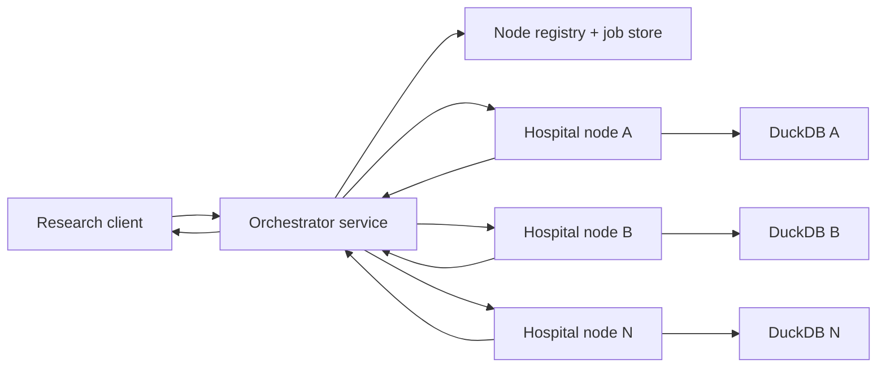

# Final Federated Analytics Plan

Date: 2026-03-11

Note: this is a historical planning document. The current implementation is SMPC-only; any plaintext references below describe an earlier milestone and are no longer the live system behavior.

## 1. Objective

Refinery currently runs as a single-hospital CLI:

- one hospital dataset is ingested into one local DuckDB database,
- one query template runs locally,
- one privacy-gated result is produced locally.

The target system is a federated multi-hospital platform:

- one orchestrator accepts a canonical query request,
- the orchestrator dispatches the request to all selected hospital nodes,
- each hospital computes its local contribution only on local data,
- the federation layer combines the local contributions into one final result,
- the design must support an initial debug mode with plaintext aggregation and a later switch to SMPC without changing the query abstraction.

## 2. Final design decisions

These decisions are fixed for the plan:

- SMPC topology: orchestrator-coordinated, not peer-to-peer between hospitals
- Differential privacy: local site policy checks plus one final DP release at federation output
- Cohort policy: both local and global thresholds must pass
- Transport: gRPC with TLS or mTLS
- Repository structure: Cargo workspace from the start
- First federation milestone: plaintext aggregation of sufficient statistics for debugging
- Query abstraction: templates must produce sufficient statistics first
- Participation policy: all selected hospitals must respond successfully or the federated job fails

## 3. Core recommendation

Do not replace the current CLI with a server-only system.

Instead:

1. extract the existing execution logic into reusable library code,
2. keep the CLI as an operator and debugging tool,
3. add a hospital-node service around the local execution engine,
4. add an orchestrator service around the federated workflow,
5. define one stable interface for "local sufficient statistics",
6. make both plaintext aggregation and SMPC use that same interface.

This is the key design choice that keeps the debug phase from becoming throwaway work.

## 4. Target architecture



### 4.1 Hospital node responsibilities

Each hospital node owns:

- its own input data,
- its own DuckDB database,
- its own node secret,
- its own local policy ledger and audit trail,
- its own runtime configuration.

Each hospital node is responsible for:

- local ingest, normalize, and materialize steps,
- request authentication and validation,
- local execution of allowlisted templates,
- creation of local sufficient statistics,
- enforcement of local threshold and policy rules,
- emission of either plaintext statistics or SMPC-ready payloads,
- local audit logging.

### 4.2 Orchestrator responsibilities

The orchestrator is responsible for:

- receiving a user query request,
- validating it against the federation allowlist,
- creating a federated job,
- dispatching one canonical request to every selected node,
- coordinating the aggregation protocol,
- enforcing all-parties-must-succeed semantics,
- applying final differential privacy noise to the global result,
- returning the final released answer,
- maintaining global job metadata and audit state.

### 4.3 What the orchestrator must not do

The orchestrator must not:

- access raw hospital data,
- open hospital DuckDB files,
- execute ad hoc SQL on behalf of users,
- depend on local site-specific schemas beyond the shared template contract.

## 5. Repository and crate structure

Convert the repository into a Cargo workspace immediately.

Suggested structure:

```text
refinery/
  Cargo.toml
  refinery-protocol/
    Cargo.toml
    src/
      lib.rs
      query.rs
      stats.rs
      federation.rs
      errors.rs
  refinery-node/
    Cargo.toml
    src/
      main.rs
      lib.rs
      config.rs
      db.rs
      fhir.rs
      ingest.rs
      normalize.rs
      materialize.rs
      query.rs
      privacy.rs
      local_policy.rs
      local_stats.rs
      server.rs
  refinery-orchestrator/
    Cargo.toml
    src/
      main.rs
      config.rs
      server.rs
      registry.rs
      jobs.rs
      protocol_runner.rs
      aggregate.rs
      dp_release.rs
      client.rs
```

### 5.1 Purpose of each crate

- `refinery-protocol`
  - shared request and response types
  - query template identifiers
  - sufficient-statistics schema
  - federation protocol abstraction
  - error and status enums
- `refinery-node`
  - all local hospital execution logic
  - CLI commands
  - gRPC server for hospital service
- `refinery-orchestrator`
  - federated job lifecycle
  - gRPC client and optional gRPC server
  - aggregation and final release

## 6. Execution model inside one hospital node

The current local pipeline stages remain valid:

1. ingest
2. normalize
3. materialize
4. query
5. privacy

But the meaning of `query` must change.

Instead of "compute final local answer and print it", the node should use this internal flow:

1. `compile_request`
   - validate template and parameters
   - derive fingerprint
   - determine statistics schema for the template
2. `execute_local_stats`
   - run local SQL
   - compute sufficient statistics
3. `apply_local_policy`
   - local cohort threshold
   - site participation policy
   - local audit and budget checks
4. `encode_federation_payload`
   - plaintext statistics in debug mode
   - share payload in SMPC mode
5. `finalize_local_job`
   - accepted or rejected
   - timings and audit completion

This separation is mandatory. It is what makes the switch from plaintext federation to SMPC low-risk.

## 7. Query abstraction: sufficient statistics first

This is a non-negotiable design rule.

Templates must no longer be treated as "final answer generators". They must become "local statistics generators".

### 7.1 Why this is required

Many final metrics do not aggregate correctly across hospitals.

Examples:

- local means cannot simply be averaged
- local risk ratios cannot simply be averaged
- local subgroup deltas cannot simply be averaged

What *does* aggregate correctly are the building blocks:

- counts
- sums
- bounded sums
- event counts
- denominator counts
- per-arm sufficient statistics

### 7.2 Template output model

Each template should expose two layers:

#### A. Local statistics layer

Returned by hospital nodes.

Examples:

- cohort feasibility:
  - `count`
- comparative effectiveness:
  - `n_exposed`
  - `n_control`
  - `sum_outcome_exposed`
  - `sum_outcome_control`
- subgroup effect:
  - per-group counts and bounded sums
- dose response:
  - per-bin counts and bounded sums
- adverse event signal:
  - event counts and denominator counts
- drug-drug interaction signal:
  - exposed pair counts and outcome counts
- time-to-event proxy:
  - event counts
  - total follow-up time
  - any bounded proxy sums needed for release

#### B. Final render layer

Computed only after federation.

Examples:

- overall count
- overall mean
- global delta
- global incidence
- final DP-protected released JSON

### 7.3 Required code change

Refactor current templates so each one has:

- `compute_local_statistics(...) -> LocalStatistics`
- `render_federated_result(stats: AggregatedStatistics) -> FederatedResult`

Do not keep current output-oriented templates as the federation boundary. That would create incorrect aggregation semantics and make SMPC harder.

## 8. Federation modes

The system should support two federation modes behind one abstraction.

### 8.1 Mode 1: Plaintext aggregation

This is the first implementation milestone and exists for debugging and validation.

Flow:

1. orchestrator sends canonical query request to all nodes
2. each node computes `LocalStatistics`
3. each node returns plaintext `LocalStatistics`
4. orchestrator aggregates them
5. orchestrator renders the final global result
6. orchestrator applies final DP release

This mode is intentionally easier to debug because local contributions are inspectable.

### 8.2 Mode 2: SMPC-ready aggregation

This is the target privacy-preserving mode after the debug milestone.

Flow:

1. orchestrator sends canonical query request to all nodes
2. each node computes exactly the same `LocalStatistics`
3. each node transforms those statistics into protocol messages or shares
4. orchestrator coordinates the protocol rounds
5. the final aggregate is reconstructed
6. orchestrator renders the final global result
7. orchestrator applies final DP release

### 8.3 Critical implementation rule

The type returned by local query execution must be the same in both modes:

- plaintext mode uses `LocalStatistics` directly
- SMPC mode converts `LocalStatistics` into protocol payloads

That guarantees the debug mode lays the groundwork for SMPC instead of creating a parallel path.

## 9. Federation protocol abstraction

Define one shared protocol boundary in `refinery-protocol`.

Suggested abstraction:

- `FederationMode`
  - `Plaintext`
  - `SmpcAdditiveSharing`
- `LocalStatistics`
- `FederationPayload`
- `AggregatedStatistics`
- `FederationResult`

Suggested orchestrator-facing behavior:

- in `Plaintext`, payload is just the statistics object
- in `SmpcAdditiveSharing`, payload is a protocol message envelope

Suggested node-facing behavior:

- always compute `LocalStatistics` first
- only then encode according to the chosen mode

This prevents SMPC logic from leaking into query SQL or template semantics.

## 10. Network/API design

Use gRPC with protobuf and TLS or mTLS.

Reason:

- strongly typed contracts
- better separation of service methods
- easier versioning than ad hoc JSON
- fits internal service-to-service communication well

This is still based on HTTP/2 under the hood, but the security comes from:

- TLS or mTLS
- service authentication
- strict RPC methods
- schema validation
- audit logging

### 10.1 Suggested node service RPCs

- `RunPipeline`
  - ingest -> normalize -> materialize locally
- `SubmitJob`
  - accept canonical query request
- `GetJobStatus`
  - return node-local job state
- `RunFederationRound`
  - receive protocol round input and return next-round output
- `GetCapabilities`
  - supported templates, protocol version, schema version
- `HealthCheck`
  - liveness and readiness

### 10.2 Suggested orchestrator behavior

The orchestrator should call nodes in parallel and treat the set of node responses as one atomic federated job.

For the first implementation:

- no partial completion
- no silent fallback
- if one selected hospital fails or rejects, the job fails

## 11. Canonical query contract

The orchestrator should send the same canonical request shape to every node.

Suggested fields:

- `job_id`
- `template`
- `params`
- `clip_min`
- `clip_max`
- `federation_mode`
- `protocol_name`
- `protocol_version`
- `requested_at`

Important constraints:

- no raw SQL
- no dynamically injected table names
- no arbitrary expressions
- only allowlisted templates and validated parameters

## 12. Differential privacy and policy model

The privacy model is split across nodes and orchestrator.

### 12.1 Local node policy

Each node must enforce:

- local authorization
- local minimum cohort threshold
- local participation policy
- local auditing
- local budget or query-rate policy if required

If the local site policy fails, the node rejects participation.

### 12.2 Global release policy

The orchestrator must enforce:

- all selected nodes succeeded
- global cohort threshold
- final result release rules
- one final differential privacy mechanism on the global result
- global audit record

### 12.3 Why final DP is applied globally

Applying DP once on the final federated output:

- preserves far better utility,
- keeps noise accounting simpler,
- avoids noise compounding across hospitals.

The local node still has strong control because it can refuse to participate before anything is released.

## 13. Failure and participation model

The first version should use strict job semantics:

- every selected node must participate successfully
- every selected node must pass local policy
- the global threshold must pass
- otherwise no result is released

This is stricter, but easier to reason about and defend.

### 13.1 Failure cases

- node unavailable
  - job fails
- node rejects on local threshold
  - job fails
- protocol version mismatch
  - job fails before execution
- timeout
  - job fails
- orchestrator restart mid-job
  - recover from persisted job state or fail cleanly

## 14. Security model

Assumed baseline threat model:

- hospitals trust their own node and local storage
- the orchestrator is trusted to coordinate jobs but should not see raw data
- services authenticate each other
- transport is encrypted
- users cannot execute arbitrary SQL
- query templates are allowlisted

For the first version:

- use TLS at minimum
- prefer mTLS if manageable
- add per-service identity
- log every federated job and every node decision

## 15. Migration plan

### Phase A: Extract reusable core

Goal:

- stop coupling execution logic to CLI argument parsing.

Tasks:

- move current pipeline and query execution into library functions
- introduce typed request and result models
- keep existing CLI commands working

Success criterion:

- single-node CLI behavior remains unchanged

### Phase B: Workspace split

Goal:

- establish durable crate boundaries.

Tasks:

- convert to Cargo workspace
- move current code into `refinery-node`
- create `refinery-protocol`
- scaffold `refinery-orchestrator`

Success criterion:

- workspace builds and current local node CLI still works

### Phase C: Sufficient-statistics refactor

Goal:

- make templates federatable.

Tasks:

- define `LocalStatistics` for each template
- refactor local query code to produce statistics first
- add global result renderer functions

Success criterion:

- federated aggregate from multiple local runs matches expected manual aggregation

### Phase D: Plaintext federation

Goal:

- prove end-to-end multi-node orchestration in a debuggable mode.

Tasks:

- implement node gRPC service
- implement orchestrator client and job runner
- send canonical requests to multiple nodes
- aggregate plaintext `LocalStatistics`
- apply final DP globally

Success criterion:

- result equals the sum or derived aggregate of independent node runs

### Phase E: SMPC protocol integration

Goal:

- replace plaintext aggregation without changing template semantics.

Tasks:

- implement `SmpcAdditiveSharing` protocol path
- encode `LocalStatistics` into protocol payloads
- coordinate protocol rounds from orchestrator
- reconstruct final aggregate

Success criterion:

- SMPC result matches plaintext federation result within numeric tolerance

### Phase F: Hardening

Goal:

- make the system robust enough for thesis evaluation and demos.

Tasks:

- protocol versioning
- retries and timeout strategy
- persistent orchestrator job store
- richer observability
- stronger auth and certificate management
- integration and failure-path tests

## 16. Testing strategy

### 16.1 Local correctness

- current CLI query results still match pre-refactor outputs
- `compute_local_statistics` is correct for every template

### 16.2 Federation correctness

- 2-node and 3-node aggregation tests
- result equality between federated plaintext mode and manual sum of local statistics

### 16.3 SMPC equivalence

- result equality between plaintext federation and SMPC federation
- protocol round tests for malformed or missing messages

### 16.4 Privacy and policy

- local threshold rejection is enforced
- global threshold rejection is enforced
- final DP budget accounting works
- no release occurs on partial failure

## 17. Immediate implementation priorities

If implementation starts next, the correct order is:

1. extract core execution functions from `main.rs`
2. create the workspace
3. add shared protocol types
4. refactor templates to sufficient statistics
5. implement gRPC node service
6. implement orchestrator in plaintext federation mode
7. verify correctness against independent local runs
8. add SMPC mode behind the same statistics interface

## 18. Final summary

The final architecture is:

- a Cargo workspace with `refinery-node`, `refinery-orchestrator`, and `refinery-protocol`,
- gRPC communication secured with TLS or mTLS,
- hospital nodes that compute local sufficient statistics only,
- an orchestrator that coordinates every federated job,
- strict all-parties-must-succeed participation,
- local policy enforcement at nodes,
- one final differential privacy release at the federated output,
- a first plaintext aggregation milestone used only for validation,
- a later SMPC mode built on the exact same statistics boundary.

That is the cleanest way to move from the current CLI to a federated system without locking the project into the wrong abstraction.
